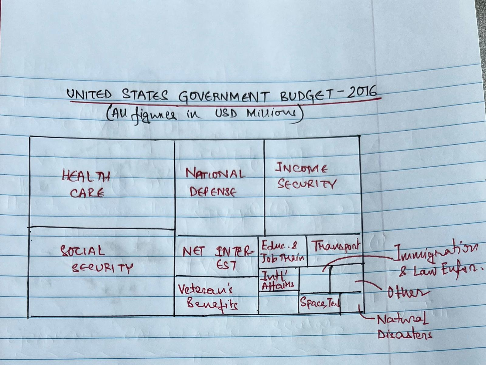
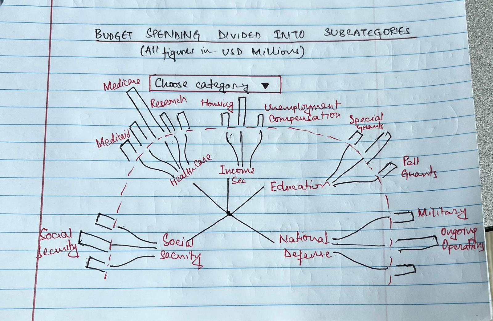

| [Home Page](https://sajujya.github.io/tswd-portfolio-sajujya/) | [Visualizing Debt](visualizing-government-debt) | [U.S. Government Budget Analysis](critique_by_design)

## Crtique by Design

### United States Government Budget - 2016 

For this assignment, I chose to recreate the visualization below. It describes the US Government Budget for the year 2016, divided into categories and subcategories. 

#### Why this visualization? 

My primary motivation to choose this visualization as my subject for this assignment was fuelled by my desire to understand the U.S. government spending at a closer level. At the outset, the budget spending is often complicated, with a lot of moving parts and is often abstruse to the naked eye. Additionally, I was shook when I saw the [visualization]("https://obamawhitehouse.archives.gov/interactive-budget") put forth by the Obama Adminstration purely because of how dull and uninteresting it looked. Hailed as the epitome of data-driven decision -making in US political history, I honestly exepcted a better visualization to be put forth by the White House. 

Therefore, I took it up as a challenge to demistify a complicated topic to a layman citizen of the US who wants to understand where the current priorities of the government lie (in 2016). Additionally, the fact that the budget is closely tied to policy decisions and political priorities, critiquing and redesigning the visualization would defnitely aid me in discussions about the policy implications of budget allocation and how the presentation of data can influence public perception and decision0making. Finally, the fact that the US Government Budget data is usually publicly available made it accessible for me to work with. 

In summary, choosing the US Government Budget felt like an able challenge due to its relvance, complexity, education value, real-world applications and policy implications. 

#### Original Visualization

> Visualization by <a href="https://obamawhitehouse.archives.gov/interactive-budget"> The White House </a>

#### Overall Process and Motivation behind the Redesign 

I started by thoroughly examining and critiquing the originl visualization that the Obama Whie House had put forth - the tree map, it's different components, what the data sources they used were and finally the message it was trying to convey. Subsequently, while completeing the critiquing part of the assignment, I identified particular strengths and weaknesses of the original visualization and noted areas the areas that needed improvement - like clarity, perceptibility and intuitiveness. 

| Strength | Weakness | Redesign Objective |
| ------------- | ------------- |------------- | 
| The heatmap structure of the initial visualization works really well. It gives a first glance understanding to the audience highlighting the major priority areas for the current government. | Too crowded to glean any insights from it. The sub-categorization into subcategories like Medicare, etc. seem excessive and make the visualization difficult to understand and comprehend. Additionally, the color scheme does not make sense. I understand that the creator tried to demarcate each of the bigger categories with a particular color and then follow the diverging color scale there on out - but given the sheer number of categories and subcategories - it just did not make the cut. | A clear and intuitive visualization that ranks equally high on the usefulness part of the critiquing metric while significantly improving the engagement and aesthetic components. In particular,  I would start with dividing up this one visualization into two. One tree map - since the concept makes sense - with only the broad categories to give the stakeholders a big picture idea of the budget spending. Then I would create another graph that would further delve deeper into each of the spending categories. Additionally, I would figure out a way to compare each of the spending categories across the bigger categories. My initial thoughts are about using some comparison based hierarchical map.|

Let's now wireframe the solution and conduct some interviews!

#### Wireframing Sketches

#### Testing the Solution

#### Interview 1 Subject: Male, Mid 20s, Student 

Q: Can you tell me what you think this is? 

A: I think this is an estimate of how much of the U.S. Government Budget in 2016 went to specific programs. The second graph seems to the subcategories of those programs broken down further. 

Q: Can you describe to me what this is telling you? 

A: These visualizations seem to be portraying where the U.S. Government aims to put their money into. Broken down by the categories and subcategories, it also highlights where the priorities of the current government lie. 

Q: Is there anything you find surprising or confusing? 

A: Okay, so it seems a little confusing because I can see that you have written that _All Figures are in Millions of USD_, but I cannot see any figures on the graphs. Maybe put that in to make the observer understand the exact dollar amounts spent on varying avenues. Addtionally, it seems surprising that the proposed spending on Education and Research is so low, given that it is often the topic of debates - especially for a Democrat government. 

Q: Who do you think is the intended audience for this visualization? 

A: Probably the general U.S. population. 

Q: Do you think it is interpretable enough for the intended audience? 

A: I think it is pretty intuitive and easy to understand for the general public. I like the fact that you have first shown the major areas of spending and then have gone into the sub-categorization - it aids the reception of the sheer volume of information. 

Q: Is there anything that you would chage or do different? 

A: Nothing really. No changes. I think you have done justice to the graphic. Good work!

#### Interview 2 Subject: 

#### Recreation of the Visualization

 

