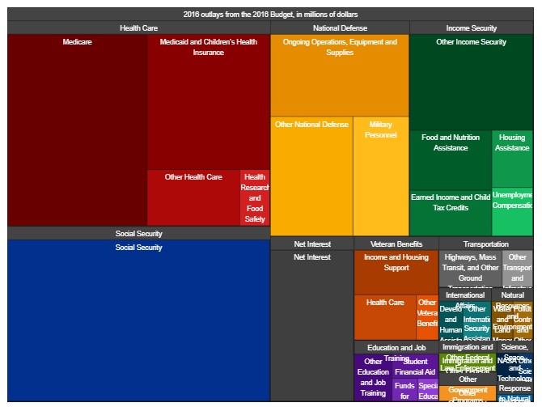

| [Home Page](https://sajujya.github.io/tswd-portfolio-sajujya/) | [Visualizing Debt](visualizing-government-debt) | [U.S. Government Budget Analysis](critique_by_design)

### Crtique by Design

#### United States Government Budget - 2016 

For this assignment, I chose to recreate the visualization below. It describes the US Government Budget for the year 2016, divided into categories and subcategories. 

> Visualization by <a href="https://obamawhitehouse.archives.gov/interactive-budget"> The White Hourse </a> 

#### Recreation of the Visualization

