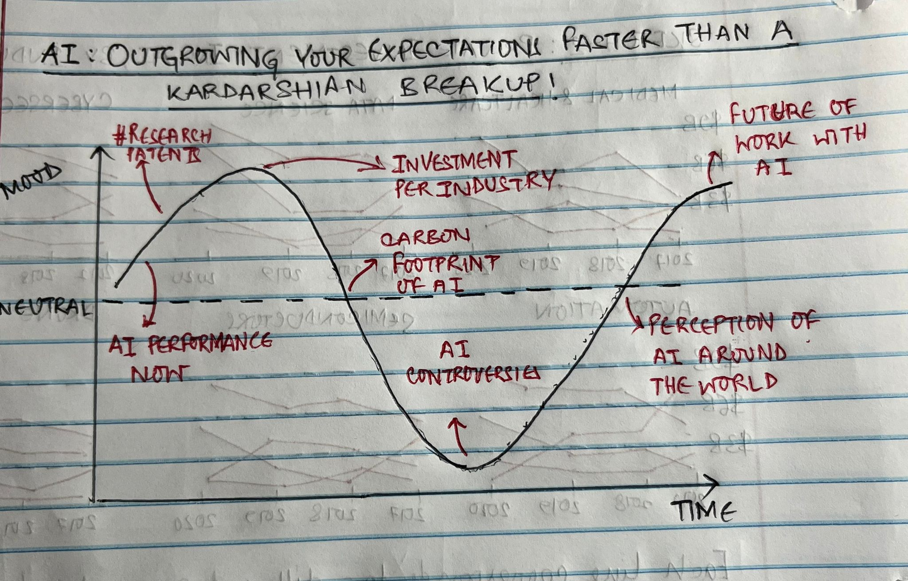
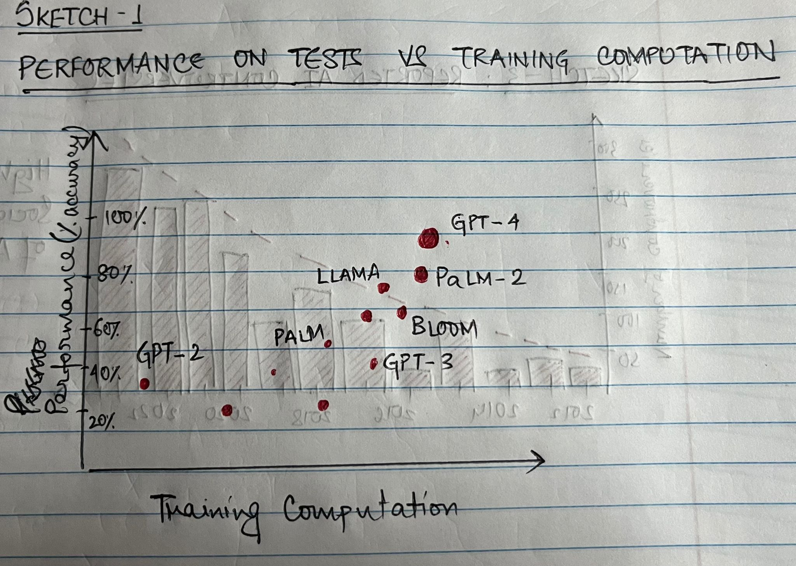
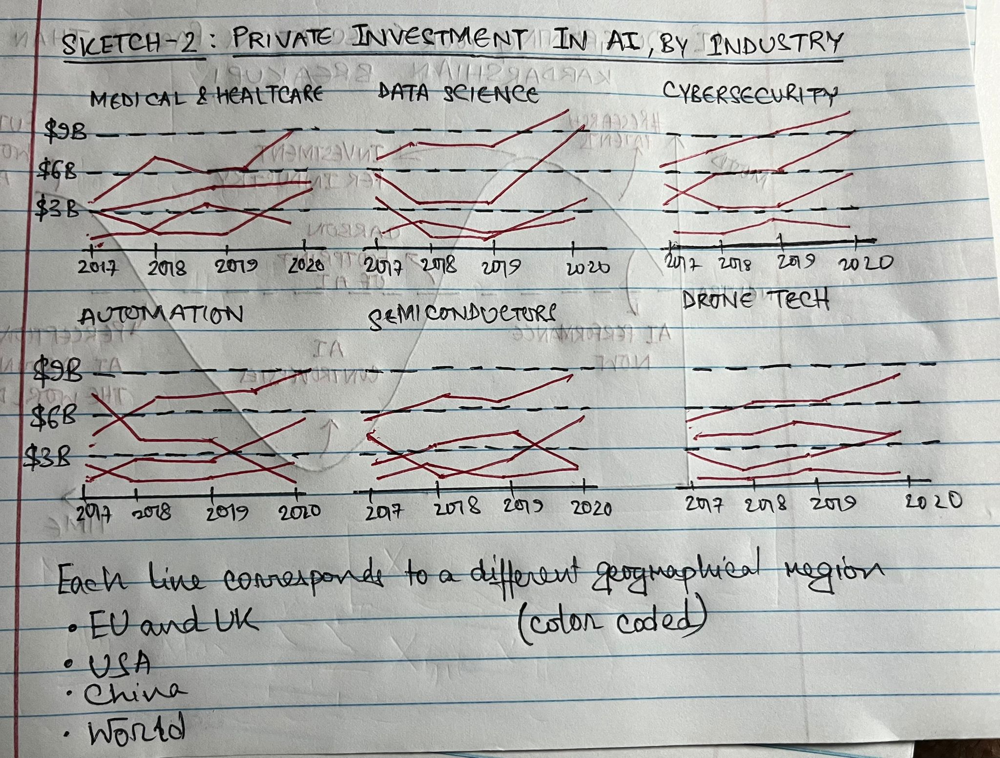
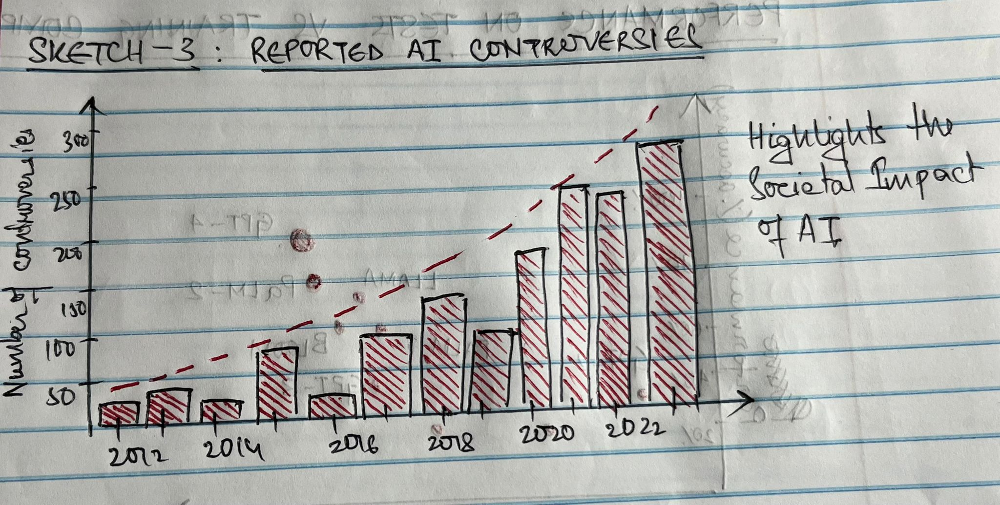

| [Home Page](https://sajujya.github.io/tswd-portfolio-sajujya/) | [Visualizing Debt](visualizing-government-debt) | [U.S. Government Budget Analysis](critique_by_design) | [AI: Scaling Up Faster Than a Viral TikTok Trend!](final-project-part-one)

<h1 align="center">AI: Outgrowing Your Expectations Faster Than a Kardashian Breakup!</h1>

## Outline of the Project

In this project, I embark on a comprehensive exploration of the incredible evolution of Artificial Intelligence in our modern world. I kick things off by tracing AI's origins and significant milestones. Here, I wish to look at the major milestones in the development of AI, and compare it on a timescale - a comparison of Training Computation with respect to time. This visualization(s) would clearly demonstrate the logarithmic growth of training computation that the industry has gone through.

In the next section, I start looking at how the research in AI has unfolded over time - from the early 2010s to 2020 (this is a data limitation). This visualization seeks to identify hotspots for AI development around the world, and looks at the growth of these hotspots over time. For this visualization, I imagine a color changing map of the world where the darker areas represent the hotspots. 

As the project unfolds further, I take a closer look at AI's profound impact on various industries, from healthcare to finance. Here, I my plan extends its gaze globally, comparing AI development across regions and highlighting key players and collaborative efforts. I aspire to do this by comparing the investment in AI by the major players in the market over time and per industry. Additioanlly, I plan to look at the countries which have Established vs Developing National Artificial Intelligence Strategies. 

Finally, my plan is to transition into the societal implications of AI. This would include the global perception of AI technology over time. This would involve an analysis of the major AI controversies in the last 10 years, coupled with survey data asking respondents to reply to quesions like "Will AI help or harm people in the next 20 years". 

My Target Audience for this project is the general populace, and my goal is to inform them of the development of AI in the last 20 years from a variety of lenses, and the scale of that development. Additionally, my project also would aim to demistify popular misconceptions about the industry, and how, if at all it will affect the Future of Work. 

## Story Arc 

## Initial sketches

# The data
In this project, I use data from various public sources to track and visualize the multi-faceted growth of AI. Almost all of my data is published by Artificial Intelligence Communities around the world , which are verified by their respective governments. Therefore, I do not expect any issues with data integrity. 

Below is a list (ideally comprehensive) of my data sources, coupled with a brief description of the data.

| Name | URL | Description | Published By |
|------|-----|-------------|--------|
|Epoch dataset on AI training compute and MMLU benchmark performance| [Link](https://docs.google.com/spreadsheets/d/1HSGbUVwGy3XLuChH_H16Keux2jmVfKT9rfDrC3uu-SQ/edit#gid=0) | This dataset contains the major breakthroughs in AI architechture, the year in which they were developed, and what the approximate size of their trainign data was. | [David Owen (2023), Extrapolating performance in language modeling benchmarks](https://epochai.org/blog/extrapolating-performance-in-language-modelling-benchmarks)
| Patent Applications per 1 Million People | [Link](https://drive.google.com/file/d/14h4GNw5Unuc0Bcv1_fYS7uTEfmRVJd-U/view?usp=sharing) | This is data at a country-year level describing the number of patents submitted per million people | [Emerging Technology Observatory Country Activity Tracker](https://cat.eto.tech/?expanded=Summary-metrics%2CChanges-over-time)
| Private Investment in AI per Business Category|[Link](https://drive.google.com/file/d/1fg3v6VgeURXC4Jzsd4PflnAyat6RRK9h/view?usp=sharing) |   This is data at a business entity - year level that has the private investments made across the US, EU, China and the World as a Whole | Inflation, consumer prices (World Bank) 
|National Strategies on Artificial Intelligence|[Link](https://drive.google.com/file/d/1u28YWlbhJDFsztSqPMQaNcgWS6-uoyAN/view?usp=sharing)|This is data at a country-year level comparing which countries had vs did not have National Strategies based on AI in that particular year. |AI Index 2023 Annual Report, AI Index Steering Committee, Institute for Human-Centered AI, Stanford University, Stanford, CA, April 2023
|Perception of AI |[Link](https://drive.google.com/file/d/1aYhJnzGtsZfyYBtTNtRUWgeB2931dF6k/view?usp=sharing)|Spread across four themed reports, the 2021 World Risk Poll covers the biggest risks facing people and communities globally, ranging from road crashes, severe weather, climate change and disaster resilience, to work-related harm, violence and harassment at work, and use of personal data. This data includes aggregates of survey responses to the following two questions: Will artificial intelligence help or harm people in the next 20 years? AND Would you feel safe in a car driven by computer without a human driver? |World Risk Poll 2021, Lloyd's Register Foundation (2022)
|Major Controversies in AI| [Link](https://drive.google.com/file/d/1IpGHqzL47F632Z9Xm_AKYqikLFa0IPnE/view?usp=sharing)|This data contains annual AI related infractions in the world| AIAAIC Repository (2022) via 2023 AI Index Reportvia the AI Index 2023 Annual Report, AI Index Steering Committee, Institute for Human-Centered AI, Stanford University, Stanford, CA, April 2023

# Method and medium

For my final project, I will be using Shorthand to narrate a story around the growth and development of AI. This narrative is meant to demistify the trajectory for the layman, and seeks to educate anyone who wants to understand what the new buzzword of the 21st century means, and what the magnitude of it's development has been - especially in the last 20 years. 

I plan to follow my outline closely, and incorporate various elements of visual design that I have learnt in the Telling Sotries with Data class to inform and better my analyses. 

